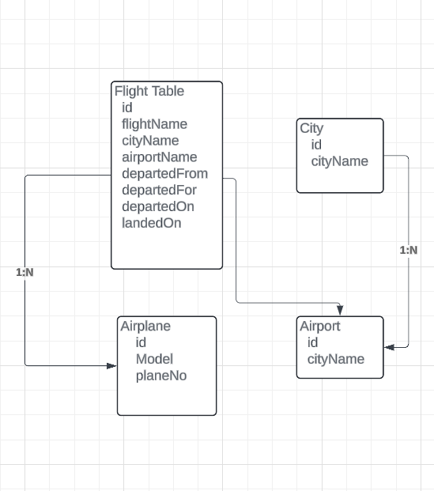

# Welcome To Flight Search Backend system

## Project Setup

- Clone the repository in your local machine
- Execute the `npm run install` in the Root Directory of the downloaded project
- create a `.env` file and copy and paste the code from `.env.sample` 
- Run `npm i sequelize-cli` `npm i sequelize` `npm i mysql2` these command
- Execute the `npx sequelize init` command into root directory of the folder
- Move `Models` `seeders` `migrations` and `config` inside src folder
- Change the `src/config/config.json` according to below
- inside the `src/config` folder create a new file `config.json` and the copy and paste the following code and put the database name and password according to you

```
"development": {
    "username": <YOUT_USER_NAME>,
    "password": <YOUR_PASSWORD>,
    "database": <YOUR_DATA_BASE_NAME>,
    "host": "127.0.0.1",
    "dialect": "mysql"
  },
```

- Once completed the above steps successfully then go to `src` root Directory and execute `npx sequelize db:create`

- After performing the above execute `npx sequelize db:create`
- crosscheck the databse has created or not


# Models for Airline System
- Airline Management system
  - Airplane Table (One Airplane can have different Flight) Airplane : Flight 1:N
  - Flight Table   (One flight can be attended by any of the Plane)  
  - Airport Table (One airport can have different flight) Airport:Flight 1:N
  - City Table  (One City can have different Airports) City:Airport 1:N




# Creatin of models
 - run `npx sequelize model:generate --name <MODEL_NAME> --attributes <ATTRIBUTE_NAME:TYPE>`
 - Exa `npx sequelize model:generate --name City --attributes name:String`
 - result `New model was created at <ROOT>` 
          `New model was created at <ROOT>`

 - Till now it's not synched with our database 
 - To make in synch with database run `flight_search_db_dev`
          


- `For running MySql Server mysql -h localhost -P 3306 -u root -p`
- or `mysql -u root -p`


